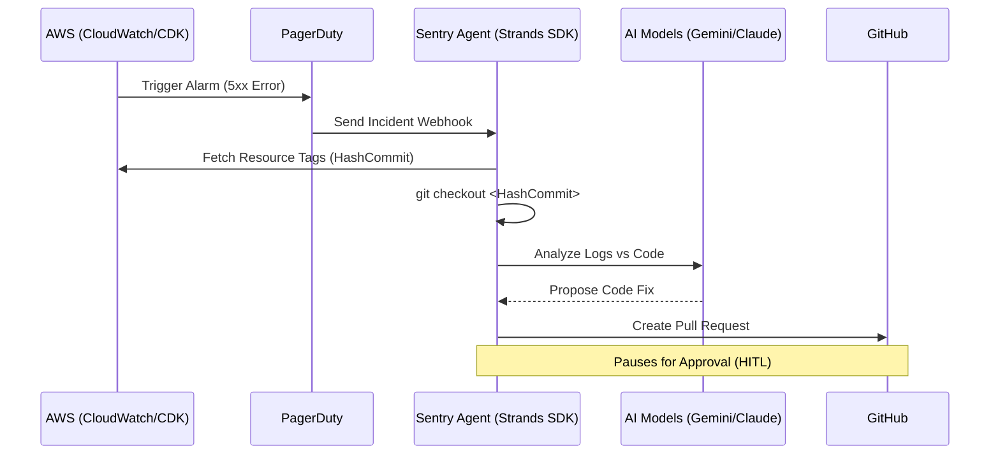

# Unified Cloud Sentry Ecosystem

This repository serves as a proof of concept for **Agentic AI** applications in cloud operations, with a primary focus on mitigating the "Context Gap" often encountered during production incidents.

## Project Objective

The objective of this project is to automate the entire remediation lifecycle—from the initial **CloudWatch alarm** to the generation of a **source-code Pull Request**. By leveraging resource tagging and the **Strands Agents SDK**, the system ensures the orchestration engine operates on the precise version of the source code associated with the service failure.

---

## Architecture Overview



---

## Repository Structure

- **/poc-ops-agent**: The autonomous remediation orchestration engine. Developed using the Strands SDK, it manages the comprehensive incident lifecycle.
- **/poc-validator-user-api**: A production-representative target system (User Management API) utilized to validate the capabilities of the Sentry Agent. Now features structured logging and advanced monitoring.

---

## Component 1: Sentry Agent

**Purpose:** Manages clinical remediation and incident orchestration.

- **Incident Lifecycle Management:** Automated acknowledgment and suppression of PagerDuty incidents during the investigation phase.
- **Version Traceability:** Utilizes the **Model Context Protocol (MCP)** to retrieve the `GitCommit` metadata from AWS resources to ensure environment parity.
- **Multi-Model Analysis:**
  - **Ollama:** Conducts local data processing and PII redaction.
  - **Gemini 1.5 Pro:** Analyzes extensive log data and complex application logic via a large context window.
  - **AWS Bedrock (Claude):** Generates high-fidelity code modifications and technical incident reports.
- **Human-in-the-Loop (HITL):** Enforces a mandatory manual review process before any code is committed to the repository.

---

## Component 2: Validator User API

**Purpose:** Target system for AI verification and validation testing.

- **Technical Stack:** Node.js 22, TypeScript, AWS CDK, Amazon DynamoDB, and **Pino** for structured logging.
- **Agent-Ready Metadata:** Adheres to strict tagging standards required for automated traceability.
- **Observability:**
  - **Structured Logging:** Integrated with Pino to provide machine-readable JSON logs for AI analysis.
  - **Application Signals & SLOs:** Automated service discovery and Service Level Objectives (Availability 99.9%, Latency < 1s) for error budget tracking.
- **Diagnostic Simulation:** Incorporates a Custom Lambda Authorizer and CloudWatch Alarms to facilitate incident detection and diagnostic verification.

The system utilizes resource tags in the CDK stack to establish the required traceability:

| Tag              | Value                     | Purpose                                                                     |
| :--------------- | :------------------------ | :-------------------------------------------------------------------------- |
| `Service`        | `User-Management-API-CDK` | Identifies the business domain and service context.                         |
| `RepositoryName` | `poc-validator-user-api`  | Directs the Agent to the relevant source code repository.                   |
| `GitCommit`      | `$(git rev-parse HEAD)`   | **Mandatory:** Specifies the exact commit hash deployed in the environment. |

---

## Getting Started

### Prerequisites

- **Node.js**: Version 22.x or higher
- **AWS CDK CLI**: Installed and configured with appropriate credentials
- **Ollama**: Local instance running for data processing
- **Environment Configuration**: Gemini and AWS Bedrock API keys configured within the agent environment

### Deployment and Verification

```bash
# 1. Navigate to the Target API Directory
cd poc-validator-user-api

# 2. Execute CI/CD Pipeline (includes tests and deployment)
./CICD.sh
```

---

## Integrated Operational Workflow

1.  **Deployment:** The Validator API is provisioned with unique `GitCommit` metadata and structured logs enabled.
2.  **Trigger:** A threshold breach or SLO violation (detected via Application Signals) generates an SNS notification.
3.  **Investigation:** The Sentry Agent identifies the specific code version via the `GitCommit` tag, initializes the local workspace, and diagnoses the root cause using structured logs.
4.  **Resolution:** The Agent generates a Pull Request for review. Upon approval, the PagerDuty incident is resolved.
